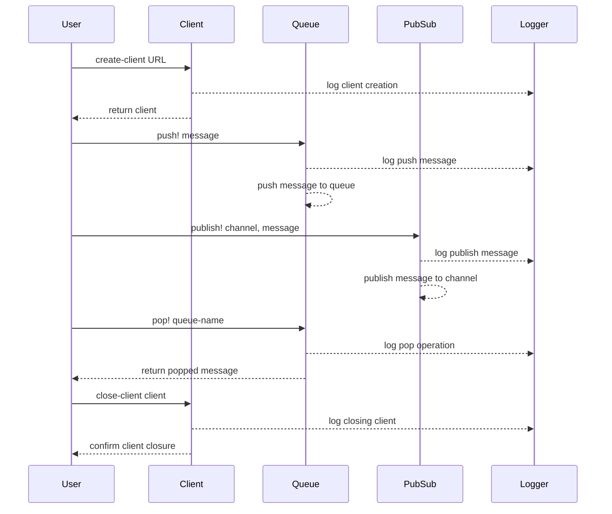

# clj-rq

RQ (Redis Queue) is a simple Clojure package for queueing jobs and processing them in the background with workers. It is backed by Redis and it is designed to have a low barrier to entry, inspired by [python-rq](https://python-rq.org).

> "simple is better than complex" - [The Zen of Python](https://peps.python.org/pep-0020/)

> clj-rq arose from the need to simplify the use of the redis queue feature used in the [SaaS version of moclojer](https://app.moclojer.com), [here's](https://www.reddit.com/r/Clojure/comments/1d1567t/redis_queue_in_clojure/) a more detailed explanation of the motivation *(a thread that generated controversy)*

## installation

We distribute the library via [Clojars](https://clojars.org/com.moclojer/rq).


[](https://clojars.org/com.moclojer/rq)

```edn
com.moclojer/rq {:mvn/version "0.x.x"}
```

```clojure
[com.moclojer/rq "0.x.x"]
```

> see the versions distributed on clojars

## example

```clojure
(ns rq.example
  (:require [com.moclojer.rq :as rq]
            [com.moclojer.rq.queue :as queue]
            [com.moclojer.rq.pubsub :as pubsub]))

(def *redis-pool* (rq/create-client "redis://localhost:6379/0"))

;; queue
(queue/push! *redis-pool* "my-queue" {:now (java.time.LocalDateTime/now)
                                      :foo "bar"})
(println :size (queue/llen *redis-pool* "my-queue"))
(prn :popped (queue/pop! *redis-pool* "my-queue"))

;; pub/sub
(def my-workers
  [{:channel "my-channel"
    :handler (fn [msg]
               (prn :msg :my-channel msg))}
   {:channel "my-other-channel"
    :handler (fn [{:keys [my data hello]}]
               (my-function my data hello))}])

(pubsub/subscribe! *redis-pool* my-workers)
(pubsub/publish! *redis-pool* "my-channel" "hello world")
(pubsub/publish! *redis-pool* "my-other-channel" {:my "moclojer team"
                                                  :data "app.moclojer.com"
                                                  :hello "maybe you'll like this website"})

(rq/close-client *redis-pool*)
```

The workflow in the given example can be represented as follows:


