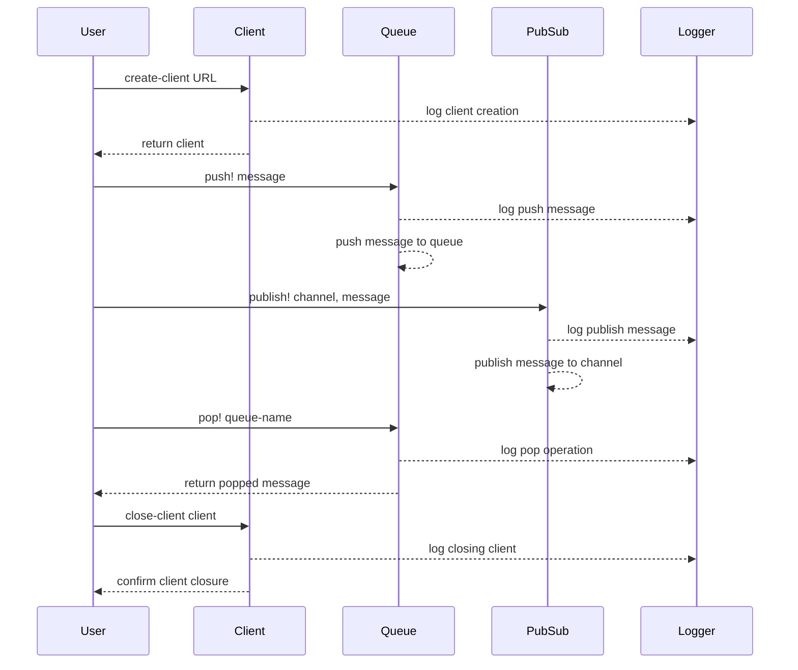

# clj-rq

RQ (Redis Queue) is a simple Clojure package for queueing jobs and processing them in the background with workers. It is backed by Redis and it is designed to have a low barrier to entry, inspired by [python-rq](https://python-rq.org).

> "simple is better than complex" - [The Zen of Python](https://peps.python.org/pep-0020/)

> clj-rq arose from the need to simplify the use of the redis queue feature used in the [SaaS version of moclojer](https://app.moclojer.com), [here's](https://www.reddit.com/r/Clojure/comments/1d1567t/redis_queue_in_clojure/) a more detailed explanation of the motivation *(a thread that generated controversy)*

## installation

We distribute the library via [Clojars](https://clojars.org/com.moclojer/rq).


[](https://clojars.org/com.moclojer/rq)

```edn
com.moclojer/rq {:mvn/version "0.x.x"}
```

```clojure
[com.moclojer/rq "0.x.x"]
```

> see the versions distributed on clojars

## building from source

We build Jedis ourselves to enable building queue functions directly using reflection. This approach ensures full compatibility with our library's features.

### prerequisites

- Make sure you have Java JDK (version X.X or higher) installed
- Ensure you have Make installed on your system

### build steps

1. Clone the repository: `git clone [repository URL]`
2. Navigate to the project directory: `cd clj-rq`
3. Run the build command: `make jedis`

After running `make jedis`, the library will be built and ready to be linked with your project. Linking in this context means that the built Jedis library will be properly referenced and used by clj-rq when you include it in your project.

## how clj-rq works under the hood

The `clj-rq` library leverages the `->wrap-method` macro to dynamically generate queue functions by wrapping methods from the Jedis library. This approach ensures that the library is always up-to-date with the latest changes in Jedis, providing enhanced security and compatibility.

The `->wrap-method` macro is defined in `src/com/moclojer/internal/reflection.clj` and is used in `src/com/moclojer/rq/queue.clj` to generate the queue functions. By using reflection, the library can dynamically adapt to changes in the Jedis API, ensuring that the generated functions are always in sync with the underlying Jedis methods.

This dynamic generation process is a key differentiator of the `clj-rq` library, making it more secure and future-proof compared to other libraries that rely on static function definitions.

## functions

This section outlines the key functions available in the clj-rq library, covering both queue and pub/sub operations. For detailed descriptions and examples of each function, please refer to the specific subsections below.

### queue

The `clj-rq` library provides a set of queue functions that are dynamically generated by wrapping methods from the Jedis library. These functions are defined in `src/com/moclojer/rq/queue.clj` and include:

- `push!`: Adds elements to the queue.
- `pop!`: Removes and returns elements from the queue.
- `bpop!`: Blocks until an element is available to pop from the queue.
- `index`: Retrieves an element at a specific index in the queue.
- `range`: Retrieves a range of elements from the queue.
- `set!`: Sets the value of an element at a specific index in the queue.
- `len`: Returns the length of the queue.
- `rem!`: Removes elements from the queue.
- `insert!`: Inserts an element into the queue at a specific position.
- `trim!`: Trims the queue to a specified range.

#### common options

All these functions share common options, such as specifying the queue name and handling encoding/decoding of messages. The options are passed as arguments to the functions and allow for flexible configuration.

#### examples

- **push!**: This function adds an element to the queue. It supports options for specifying the direction (left or right) and encoding the message before pushing it to the queue.

> [!WARNING]
> The element or elements to be pushed into a queue has to be passed inside a sequentiable (a vector for example).

```clojure
(rq-queue/push! client "my-queue" ["message"] {:direction :left})
```

- **pop!**: This function removes and returns an element from the queue. It supports options for specifying the direction (left or right) and decoding the message after popping it from the queue.

```clojure
(rq-queue/pop! client "my-queue" {:direction :right})
```

- **bpop!**: This function blocks until an element is available to pop from the queue. It is useful in scenarios where you need to wait for new messages to arrive.

```clojure
(rq-queue/bpop! client "my-queue" {:timeout 5})
```

- **index**: This function retrieves an element at a specific index in the queue. It supports options for decoding the retrieved message.

```clojure
(rq-queue/index client "my-queue" 0)
```

- **range**: This function retrieves a range of elements from the queue. It supports options for decoding the retrieved messages.

```clojure
(rq-queue/range client "my-queue" 0 -1)
```

- **set!**: This function sets the value of an element at a specific index in the queue. It supports options for encoding the message before setting it.

```clojure
(rq-queue/set! client "my-queue" 0 "new-message")
```

- **len**: This function returns the length of the queue. It is useful for monitoring the size of the queue.

  ```clojure
  (rq-queue/len client "my-queue")
  ```

- **rem!**: This function removes elements from the queue based on a specified pattern. It supports options for specifying the number of elements to remove.

```clojure
(rq-queue/rem! client "my-queue" "message" {:count 2})
```

- **insert!**: This function inserts an element into the queue at a specific position. It supports options for encoding the message before inserting it.

```clojure
(rq-queue/insert! client "my-queue" "pivot-message" "new-message" {:position :before})
```

- **trim!**: This function trims the queue to a specified range. It is useful for maintaining the size of the queue within certain limits.

```clojure
(rq-queue/trim! client "my-queue" 0 10)
```

### pubsub

The `clj-rq` library provides a set of pub/sub functions that facilitate message publishing and subscription in a Redis-backed system. These functions are defined in `src/com/moclojer/rq/pubsub.clj` and include:

- `publish!`: Publishes a message to a specified channel.
- `group-handlers-by-channel`: Groups message handlers by their associated channels.
- `create-listener`: Creates a listener that processes messages from subscribed channels.
- `unarquive-channel!`: Unarchives a channel, making it active again.
- `pack-workers-channels`: Packs worker channels into a format suitable for processing.
- `subscribe!`: Subscribes to one or more channels and processes incoming messages.

#### examples

- **publish!**: This function publishes a message to a specified channel. It is used to send messages to subscribers listening on that channel.

```clojure
(rq-pubsub/publish! client "my-channel" "Hello, World!")
```

- **subscribe!**: This function subscribes to one or more channels and processes incoming messages using the provided handlers.

```clojure
(rq-pubsub/subscribe! client ["my-channel"] handlers)
```

- **unarquive-channel!**: This function unarchives a channel, making it active again. It is useful for reactivating channels that were previously archived.

```clojure
(rq-pubsub/unarquive-channel! client "my-channel")
```
  
## complete example

```clojure
(ns rq.example
  (:require [com.moclojer.rq :as rq]
            [com.moclojer.rq.queue :as queue]
            [com.moclojer.rq.pubsub :as pubsub]))

(def *redis-pool* (rq/create-client "redis://localhost:6379/0"))

;; queue
(queue/push! *redis-pool* "my-queue"
             ;; has to be an array of the elements to push
             [{:now (java.time.LocalDateTime/now)
              :foo "bar"}])

(println :size (queue/len *redis-pool* "my-queue"))
(prn :popped (queue/pop! *redis-pool* "my-queue"))

;; pub/sub
(def my-workers
  [{:channel "my-channel"
    :handler (fn [msg]
               (prn :msg :my-channel msg))}
   {:channel "my-other-channel"
    :handler (fn [{:keys [my data hello]}]
               (my-function my data hello))}])

(pubsub/subscribe! *redis-pool* my-workers)
(pubsub/publish! *redis-pool* "my-channel" "hello world")
(pubsub/publish! *redis-pool* "my-other-channel"
                 {:my "moclojer team"
                 :data "app.moclojer.com"
                 :hello "maybe you'll like this website"})

(rq/close-client *redis-pool*)
```

The workflow in the given example can be represented as follows:



---

Made with 💜 by [moclojer](https://moclojer.com).
