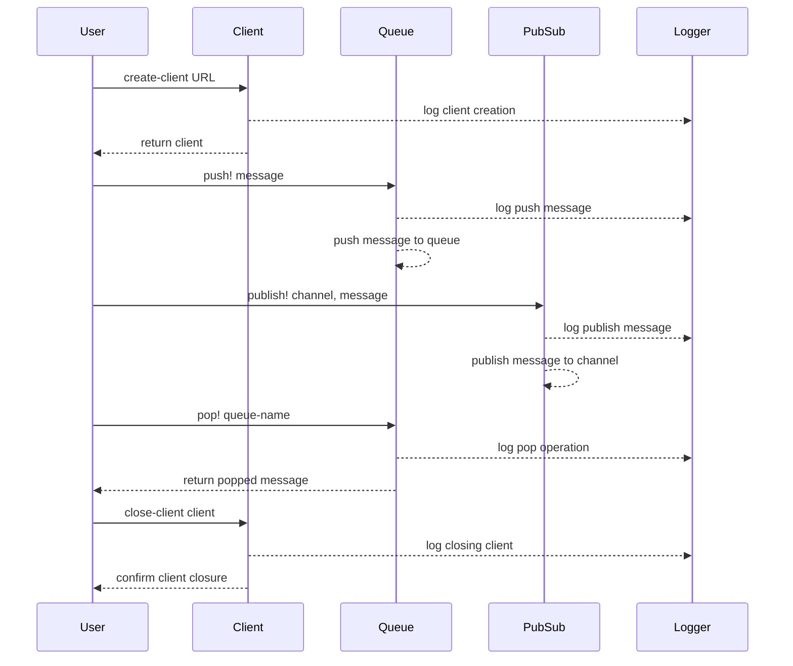

# clj-rq

RQ (Redis Queue) is a simple Clojure package for queueing jobs and processing them in the background with workers. It is backed by Redis and it is designed to have a low barrier to entry, inspired by [python-rq](https://python-rq.org).

> "simple is better than complex" - [The Zen of Python](https://peps.python.org/pep-0020/)

## installation

We distribute the library via [Clojars](https://clojars.org/com.moclojer/rq).

```edn
com.moclojer/rq {:mvn/version "0.1.2"}
```

```clojure
[com.moclojer/rq "0.1.2"]
```

## example

```clojure
(ns rq.example
  (:require [com.moclojer.rq :as rq]
            [com.moclojer.rq.queue :as queue]
            [com.moclojer.rq.pubsub :as pubsub]))

(def *redis-pool* (rq/create-client "redis://localhost:6379/0"))

;; queue
(queue/push! *redis-pool* "my-queue" {:now (java.time.LocalDateTime/now)
                                      :foo "bar"})
(println :size (queue/llen *redis-pool* "my-queue"))
(prn :popped (queue/pop! *redis-pool* "my-queue"))

;; pub/sub
(pubsub/subscribe! *redis-pool* #(prn :chan %1 :msg %2) ["name-subs"])
(pubsub/publish! *redis-pool* "name-subs" {:hello true)})

(rq/close-client *redis-pool*)
```

The workflow in the given example can be represented as follows:


